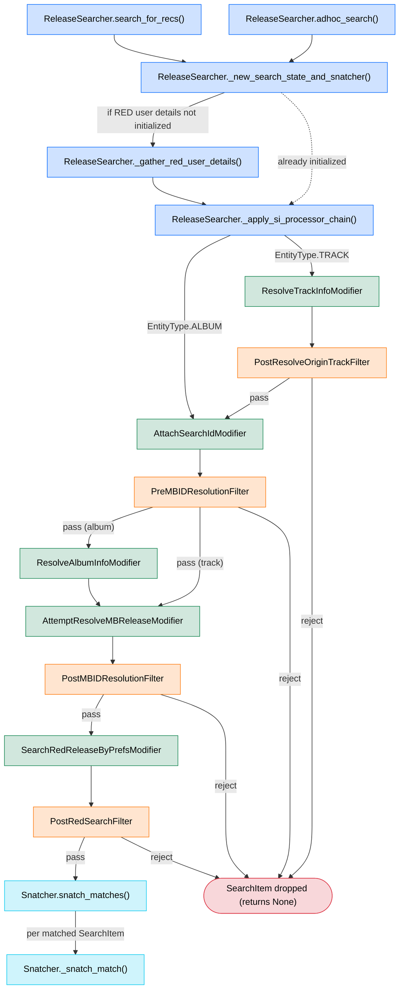
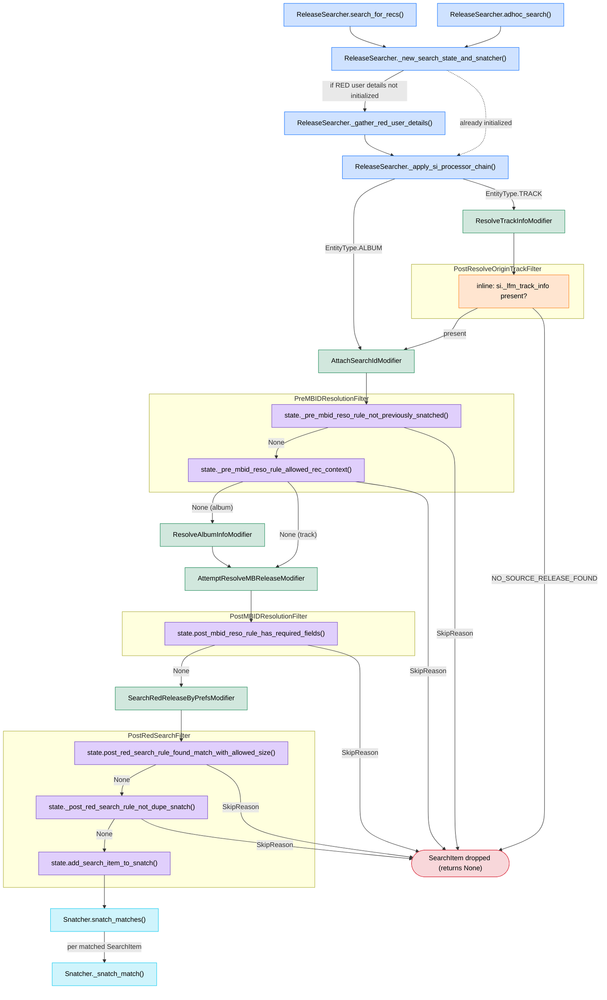

# ReleaseSearcher Search Process Overview

This document visualizes the control flow of the `ReleaseSearcher`'s search process as a
directed acyclic graph (DAG).

- **Nodes** are `ReleaseSearcher` method calls (blue), `Snatcher` method calls (cyan), and the
  individual `SearchItemModifier` (green) / `SearchItemFilter` (orange) processors applied to each
  `SearchItem`.
- **Edges** point FROM a node TO the node that runs next.

Each search invocation first builds fresh per-run state via
`ReleaseSearcher._new_search_state_and_snatcher()` (a new `SearchState` plus the `Snatcher` that
owns it), gathering RED user details if they have not been fetched yet. Keeping this state out of
`__init__` lets a single `ReleaseSearcher` be reused across calls (the FastAPI app builds it once
at startup) without one run's matches leaking into the next.

Each `SearchItem` is then processed by an ordered sequence of modifiers and filters that branches by
`EntityType` (album vs. track) and re-converges on the processors the two share. Every
`SearchItemFilter` may short-circuit processing: if its rules reject the item, the item is
dropped (recorded with a `SkipReason`). Modifiers enrich the item in place and always pass it
along. Items that survive become snatch candidates handed off to the `Snatcher`. (See the
[Chain ordering reference](#chain-ordering-reference) for the exact per-entity ordering.)

## Detailed view: filter → `SearchState` delegation

The diagram below expands every `SearchItemFilter` into the individual `SearchState` rule
methods it delegates to (purple). Each filter runs its rules in order; the first rule that
returns a `SkipReason` drops the item, otherwise the item advances. The final
`PostRedSearchFilter` rule, `add_search_item_to_snatch()`, always returns `None` (it registers
the match rather than rejecting it), so it passes the surviving item on to snatching.

> Note: `PostResolveOriginTrackFilter` does **not** delegate to a `SearchState` method — it
> applies an inline rule on the `SearchItem` itself (orange) and is shown here for completeness.

## Chain ordering reference

The chains are defined on `SearchItemProcessorChain` in
[`processors/chains.py`](./processors/chains.py):

| Order | `album_chain` | `track_chain` |
| ----- | ------------- | ------------- |
| 1 | `AttachSearchIdModifier` | `ResolveTrackInfoModifier` |
| 2 | `PreMBIDResolutionFilter` | `PostResolveOriginTrackFilter` |
| 3 | `ResolveAlbumInfoModifier` | `AttachSearchIdModifier` |
| 4 | `AttemptResolveMBReleaseModifier` | `PreMBIDResolutionFilter` |
| 5 | `PostMBIDResolutionFilter` | `AttemptResolveMBReleaseModifier` |
| 6 | `SearchRedReleaseByPrefsModifier` | `PostMBIDResolutionFilter` |
| 7 | `PostRedSearchFilter` | `SearchRedReleaseByPrefsModifier` |
| 8 | — | `PostRedSearchFilter` |
